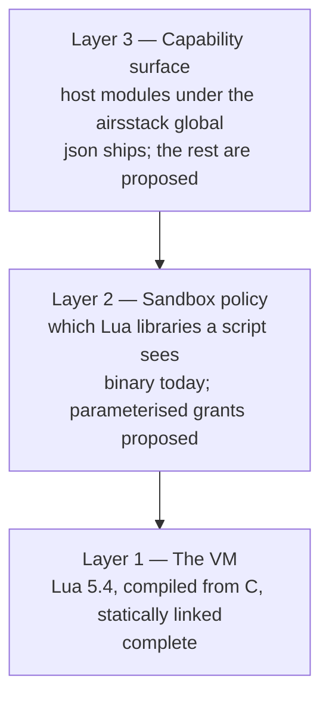

# Architecture

Orientation for someone who has not read this crate before, and the structural decisions worth
understanding before your first edit.

The thing to internalise first: `airsl` is a **boundary**, not an interpreter. Lua 5.4 is compiled
from C source and statically linked into the binary, so there is no interpreter to install and no
subprocess to spawn — but that is the least interesting part. What the crate is actually for is the
line between the host and the script, and the host's total control over where that line sits.

A script can do exactly what the host installed and nothing else. That property is what makes the
crate serviceable both as a script runner and as the substrate for an extension system.

## Three layers

The single most common confusion about this crate is collapsing these into one. They are
independent, they fail differently, and they are at different stages of completion.



**Layer 1 — the VM.** `mlua` with the `vendored` feature (`Cargo.toml:44`) compiles Lua 5.4's C
sources from the `lua-src` crate and links them statically. A C compiler is therefore a build
requirement; nothing is installed on the machine and `pkg-config` is not involved. Lua 5.4 rather
than 5.1 or LuaJIT because only 5.3 and later distinguish integers from floats in the VM, and
byte-stable JSON output depends on that distinction.

This layer is finished. `nm` on the built binary finds 93 `lua_*` C API symbols compiled in, and
`ldd` shows no Lua library among its dynamic dependencies.

**Layer 2 — sandbox policy.** Which of Lua's *own* libraries a script may see.
`Sandbox::Restricted` selects `STRING | TABLE | MATH | COROUTINE | OS` (`builder.rs:100-105`), then
removes the chunk loaders (`builder.rs:32`) and the `os` functions that reach outside the process
(`builder.rs:40-48`). `Sandbox::Full` selects `StdLib::ALL_SAFE`, which restores `io`, `os`,
`package` and `require` — everything except `debug`.

This layer works but is coarse: two values, no parameters, no resource limits.
[sandbox.md](sandbox.md) proposes what replaces it.

**Layer 3 — the capability surface.** Rust functions installed as subtables of a single Lua global,
`airsstack`. One module ships (`airsstack.json`); the rest of the roster is in
[stdlib.md](stdlib.md).

## What a script sees today

| Sandbox | Lua libraries | Host modules |
|---|---|---|
| `Restricted` (default) | `string`, `table`, `math`, `coroutine`, pure `os`. No `io`, `debug`, `package`, `require`, chunk loaders | `airsstack.json` |
| `Full` (`--unrestricted`) | everything except `debug` — including `io`, `os`, `package`, `require` | `airsstack.json` |

The practical consequence, and it is easy to miss: **under `--unrestricted`, `airsl` already runs
arbitrary Lua today.** `io.open`, `os.getenv`, `io.popen` and `require` all work. The host standard
library is not what makes Lua scripts runnable — it is what makes them *portable, deterministic and
grantable*. Those are different goals, and conflating them leads to the wrong conclusion about what
is blocking what.

## The extension seam

`HostModule` (`registry.rs:44-55`) is a public trait; `ModuleSet` and `stdlib()` are public. A
downstream crate contributes capabilities without modifying `airsl`:

```rust
let mut set = airsl::modules::stdlib()?;                      // the built-ins
set.insert(Box::new(Redis(ModuleName::new("redis")?)))?;      // plus yours
let engine = Engine::builder().sandbox(Sandbox::Restricted).stdlib(set).build()?;
```

This was verified from a separate crate outside the workspace: the custom module installed at
`airsstack.redis.get`, and the built-in `json` module remained available alongside it. The seam
works.

Four gaps stand between it and an extension system proper, and three of them change public
signatures — cheap now, breaking once anything else implements `HostModule`:

- **`airsl` does not re-export `mlua`.** A downstream crate must declare `mlua` itself at a matching
  version, because `HostModule::install` takes `&mlua::Lua` from *airsl's* `mlua`. A version
  mismatch produces type errors that do not name the real cause. `pub use mlua;` fixes it.
- **One hardcoded root table.** `ROOT_TABLE` is a `const` at `engine.rs:25`, so a third party's
  module lands at `airsstack.redis` — someone else's system under your namespace. This wants to be
  per-engine.
- **No `Send + Sync` bound on `HostModule`,** and `mlua`'s `send` feature is off. `Engine` is
  therefore neither `Send` nor `Sync` — verified by compiling a bound assertion, which fails on both
  `Rc<ReentrantMutex<RawLua>>` inside `mlua::Lua` and on `dyn HostModule` itself. Nothing async can
  hold an `Engine` across an await or share one between tasks.
- **Confined `require` is half-built.** `script.rs:3-11` documents that a `Script` "carries the
  directory that `require` is confined to", and `Script::root` records it. Nothing reads it:
  `grep -rn "root()\|\.root\b" crates/airsl/src/engine.rs crates/airsl/src/builder.rs crates/airsl-cli/src/`
  returns nothing. The same search finds live uses elsewhere in the crate, so the method works — the
  wiring is simply absent. Multi-file extensions need this.

## Engine lifecycle, and why it is an architectural decision

Measured on this repository:

```
Engine construction:            92 µs
eval, engine reused:           5.5 µs
eval, fresh engine each time:  47.1 µs
```

An 8.5× difference between reusing a state and rebuilding one. For the CLI it is irrelevant — a
process spawn costs 2.2 ms, which dwarfs everything above and is itself within 30% of a bare `sh`
spawn. For an embedded consumer it is the difference between a viable dispatch path and a wasteful
one, and for a registered extension called on every event it is the whole design.

So **engine reuse is an API-shape question, not an optimisation**, and it wants settling before
consumers form habits. The relevant follow-on: a reused engine accumulates global state between
scripts. `mlua`'s one-call environment restore (`Lua::sandbox(bool)`) is Luau-only —
`#[cfg(any(feature = "luau", doc))]` at `mlua-0.12.0/src/state.rs:675` — so isolation between
successive scripts on one engine has to be built rather than borrowed.

## Failure policy

`FailurePolicy` puts a convention into the type system. A script running as an editor or agent hook
must not turn its own failure into a non-zero exit, because the caller reads that as a signal rather
than a diagnostic — a `PreToolUse` hook exiting 2 blocks the tool call that triggered it, and the
matcher for such hooks commonly covers `Read`, so a merely-broken script would block every file read
in a session.

`FailurePolicy::FailOpen` says so in a type. `FailurePolicy::Report` is the default for anything a
person invoked directly. The CLI exposes it as `--fail-open` rather than an in-script setting
because a syntax error happens before any in-script setting could take effect, and that is precisely
the case the behaviour exists for.

## Conventions worth knowing before you edit

- **Every module is a capability.** `path` manipulation needs no authority and `fs` access does, so
  they are separate modules rather than one convenient namespace. If a proposed function would make
  a module need a grant it did not previously need, that is a design decision, not a detail.
- **Determinism is a correctness property.** Sorted keys, sorted directory listings, C-locale byte
  ordering. `builder.rs:40-48` withholds `os.setlocale` for exactly this reason: Lua compares strings
  with `strcoll`, so a locale change silently alters the sort order of every subsequent `table.sort`.
- **Enforcement lives in Rust, never in Lua.** A grant is checked inside the host function, before
  the operation. Lua never holds a file handle or a process handle — it holds a string and calls in.
- **The type-state builder makes the sandbox unforgettable.** There is no `build()` until
  `sandbox()` has been called (`builder.rs:58-80`), so "did I remember to sandbox it" is not a
  question any call site has to ask.

## Where to go next

- [sandbox.md](sandbox.md) — the policy model that replaces the two-value enum.
- [stdlib.md](stdlib.md) — the module roster and what each one owes its callers.
- [extensions.md](extensions.md) — manifests, negotiation, and the host API built on all of it.
