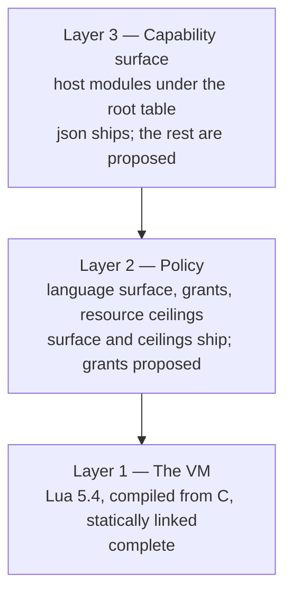

# Architecture

Orientation for someone who has not read this crate before, and the structural decisions worth
understanding before your first edit.

The thing to internalise first: `airsl` is a **boundary**, not an interpreter. Lua 5.4 is compiled
from C source and statically linked into the binary, so there is no interpreter to install and no
subprocess to spawn — but that is the least interesting part. What the crate is actually for is the
line between the host and the script, and the host's total control over where that line sits.

A script can do exactly what the host installed and nothing else. That property is what makes the
crate serviceable both as a script runner and as the substrate for an extension system.

## Three layers

The single most common confusion about this crate is collapsing these into one. They are
independent, they fail differently, and they are at different stages of completion.



**Layer 1 — the VM.** `mlua` with the `vendored` feature (`Cargo.toml:44`) compiles Lua 5.4's C
sources from the `lua-src` crate and links them statically. A C compiler is therefore a build
requirement; nothing is installed on the machine and `pkg-config` is not involved. Lua 5.4 rather
than 5.1 or LuaJIT because only 5.3 and later distinguish integers from floats in the VM, and
byte-stable JSON output depends on that distinction.

This layer is finished. `nm` on the built binary finds 93 `lua_*` C API symbols compiled in, and
`ldd` shows no Lua library among its dynamic dependencies.

**Layer 2 — policy.** Three independent questions, previously collapsed into one switch: which of
Lua's *own* libraries a script may see, what the host modules it reaches may touch, and how much it
may consume.

`LanguageSurface` answers the first (`sandbox/language_surface.rs:70-79`), with the withheld globals
listed beside the variants that withhold them (`sandbox/language_surface.rs:20-36`).
`ResourceLimits` answers the third and arms itself on the state before any module is installed
(`sandbox/resource_limits.rs:143-165`), so no caller can hold an engine whose ceilings are not yet
in force.

`GrantSet` answers the second and is the piece that does not ship. It carries two states —
unrestricted, or declared-and-currently-empty — because the presets need that much, and no more,
until a module exists that takes a grant. [sandbox.md](sandbox.md) has the model it grows into.

**Layer 3 — the capability surface.** Rust functions installed as subtables of a single Lua global,
named per engine and defaulting to `airsstack`. One module ships (`airsstack.json`); the rest of the
roster is in [stdlib.md](stdlib.md).

## What a script sees today

| Preset | Lua libraries | `require` | Ceilings | Host modules |
|---|---|---|---|---|
| `trusted` | everything except `debug` — including `io`, `os`, `package` | Lua's own, unconfined | none | `airsstack.json` |
| `confined` (default) | `string`, `table`, `math`, `coroutine`, pure `os` | confined to the script directory | 64 MiB, 100M instructions | `airsstack.json` |
| `pure` | `string`, `table`, `math` | none | 16 MiB, 10M instructions | `airsstack.json` |

The practical consequence, and it is easy to miss: **under `--policy trusted`, `airsl` already runs
arbitrary Lua today.** `io.open`, `os.getenv`, `io.popen` and `require` all work. The host standard
library is not what makes Lua scripts runnable — it is what makes them *portable, deterministic and
grantable*. Those are different goals, and conflating them leads to the wrong conclusion about what
is blocking what.

`utf8` is absent below `trusted`, and that is worth knowing because it was originally an accident
rather than a decision — the bit was simply never included in the library set. It needs no authority
and hazards no determinism, so the argument for adding it is strong; it stays out for now only
because it would widen the surface, and gets decided with the standard library.

## The extension seam

`HostModule` (`registry.rs:44-55`) is a public trait; `ModuleSet` and `stdlib()` are public. A
downstream crate contributes capabilities without modifying `airsl`:

```rust
let mut set = airsl::modules::stdlib()?;                      // the built-ins
set.insert(Box::new(Redis(ModuleName::new("redis")?)))?;      // plus yours
let engine = Engine::builder()
    .policy(Policy::confined())
    .root_table(RootTable::new("myapp")?)                     // your namespace, not ours
    .stdlib(set)
    .build()?;
```

This was verified from a separate crate outside the workspace: the custom module installed under the
root table, and the built-in `json` module remained available alongside it. The seam works.

Four gaps used to stand between it and an extension system proper. All four are closed, and what
each cost is worth recording, because the same trade-offs recur:

- **`mlua` is re-exported.** `HostModule::install` takes `&mlua::Lua`, which puts the binding in the
  contract rather than behind it. A contributor depending on `airsl::mlua` stays on the version the
  engine was built with; a separate declaration at a skewed version produces type errors that never
  mention the real cause.
- **The root table is per engine.** `RootTable` validates it, refusing Lua's reserved words and the
  globals a root would shadow — `ModuleName` accepts `os` and `end` quite happily, and both are
  catastrophic as a global. A third party's module no longer lands in a namespace named after
  somebody else's system.
- **`Engine` is `Send + Sync`.** `mlua`'s `send` feature plus a supertrait bound on `HostModule`;
  the supertraits propagate to the trait object, so the boxed modules needed no textual change.
  This one has a measured price: the state guard becomes an atomic lock acquisition, costing about
  125 ns on every Lua-to-Rust crossing — roughly a fifth of the host-call path, and nothing at all
  on pure Lua.
- **Confined `require` is built.** Not narrowed: below `trusted` there is no `require`, no `package`
  and no chunk loader to constrain, so it is a Rust function that resolves against `Script::root`,
  canonicalises, checks containment, and loads. A target cannot contain a path separator or a `..`
  component, so an escape is unrepresentable rather than merely rejected, and what remains for the
  filesystem to catch is a symlink pointing out of the root. Cycles raise rather than recursing,
  which matters because the alternative is a C stack overflow that aborts the process.

What `Engine: Sync` buys is a *shared* engine, not a *parallel* one. `mlua` locks its state per
operation (`mlua-0.12.0/src/state.rs:58`), and an evaluation is four of them — reset the budget,
write `arg`, install `require`, run the chunk. That was enough for memory safety and not enough for
correctness: eight threads evaluating `return arg[1]` on one engine got another thread's argument
12,247 times out of 16,000. `Engine` now holds a lock spanning the whole sequence
(`engine.rs:142-161`), which takes that to zero. Lua on one state cannot execute in parallel
whatever we do, so the lock costs an uncontended acquisition and no throughput — a shared engine is
a way to avoid rebuilding a state, never a way to get parallelism.

## Engine lifecycle, and why it is an architectural decision

Measured on this repository:

```
Engine construction:            40 µs
eval, engine reused:           4.2 µs
eval, fresh engine each time:   48 µs
```

An order of magnitude between reusing a state and rebuilding one. For the CLI it is irrelevant — a
process spawn costs 2.3 ms, which dwarfs everything above and is itself within 40% of a bare `sh`
spawn. For an embedded consumer it is the difference between a viable dispatch path and a wasteful
one, and for a registered extension called on every event it is the whole design.

Roughly a quarter of the eval figure is the instruction hook, which fires on the VM's hot path.
Lifting the ceiling brings the reused path to 3.4 µs. That is the price of being able to stop a
script that never terminates, and it is a policy choice rather than a fixed cost.

So **engine reuse is an API-shape question, not an optimisation**, and each thing that has to be
per-evaluation is one the CLI could never have caught, because it runs one script per process:

| Per evaluation | Kept across evaluations |
|---|---|
| the instruction counter, reset before each run | the `require` module cache, keyed by canonical path |
| the `arg` table, including `arg[0]` | the Lua globals a script wrote |
| `require`, pointed at the current script's root | whatever garbage the collector has not taken |

The right-hand column is not symmetrical with the left by accident, and one row of it used to be on
the wrong side: the module cache was rebuilt per evaluation, so a reused engine re-ran every module
it required — three evaluations of a script requiring a counter returned 1, 2, 3 where Lua's own
`package.loaded` would give 1, 1, 1. Cached state was being discarded and leaked state was being
kept, which is exactly inverted for a dispatch path.

What remains unsolved is the rest of the global state a reused engine accumulates. `mlua`'s one-call
environment restore (`Lua::sandbox(bool)`) is Luau-only —
`#[cfg(any(feature = "luau", doc))]` at `mlua-0.12.0/src/state.rs:673` — so isolation between
successive scripts on one engine has to be built rather than borrowed. Nothing needs it until
registered extensions exist. One instance of it is closed rather than merely documented: the shared
string metatable is hidden behind `__metatable` below `Full` (`builder.rs`,
`protect_string_metatable`), because a script that reached it could replace a method for every
string in the state — and the next script would call `('x'):upper()` and have no way to notice. The
memory ceiling has the same shape as the general problem: it caps the state, not the script, so an
engine carries earlier scripts' garbage until the collector runs.

## Failure policy

`FailurePolicy` puts a convention into the type system. A script running as an editor or agent hook
must not turn its own failure into a non-zero exit, because the caller reads that as a signal rather
than a diagnostic — a `PreToolUse` hook exiting 2 blocks the tool call that triggered it, and the
matcher for such hooks commonly covers `Read`, so a merely-broken script would block every file read
in a session.

`FailurePolicy::FailOpen` says so in a type. `FailurePolicy::Report` is the default for anything a
person invoked directly. The CLI exposes it as `--fail-open` rather than an in-script setting
because a syntax error happens before any in-script setting could take effect, and that is precisely
the case the behaviour exists for.

## Conventions worth knowing before you edit

- **Every module is a capability.** `path` manipulation needs no authority and `fs` access does, so
  they are separate modules rather than one convenient namespace. If a proposed function would make
  a module need a grant it did not previously need, that is a design decision, not a detail.
- **Determinism is a correctness property.** Sorted keys, sorted directory listings, C-locale byte
  ordering. `sandbox/language_surface.rs:28-36` withholds `os.setlocale` for exactly this reason: Lua
  compares strings with `strcoll`, so a locale change silently alters the sort order of every
  subsequent `table.sort`. The same reasoning is why `Minimal` drops `os` outright — `os.time` and
  `os.clock` are the last things a script can reach without a host module that differ between runs.
- **Enforcement lives in Rust, never in Lua.** A grant is checked inside the host function, before
  the operation. Lua never holds a file handle or a process handle — it holds a string and calls in.
- **The type-state builder makes the policy unforgettable.** There is no `build()` until `policy()`
  has been called, so "did I remember to sandbox it" is not a question any call site has to ask.
- **A resource breach is not a script failure.** `Error::MemoryLimit` and `Error::InstructionLimit`
  are separate variants, classified structurally — the engine's own counter and the VM error chain,
  never the message text, so a script cannot disguise its own failure as a breach or the reverse.
  The CLI acts on the distinction: a breach is reported even under `--fail-open`, where an ordinary
  failure is not.

## Where to go next

- [sandbox.md](sandbox.md) — the policy model that replaces the two-value enum.
- [stdlib.md](stdlib.md) — the module roster and what each one owes its callers.
- [extensions.md](extensions.md) — manifests, negotiation, and the host API built on all of it.
