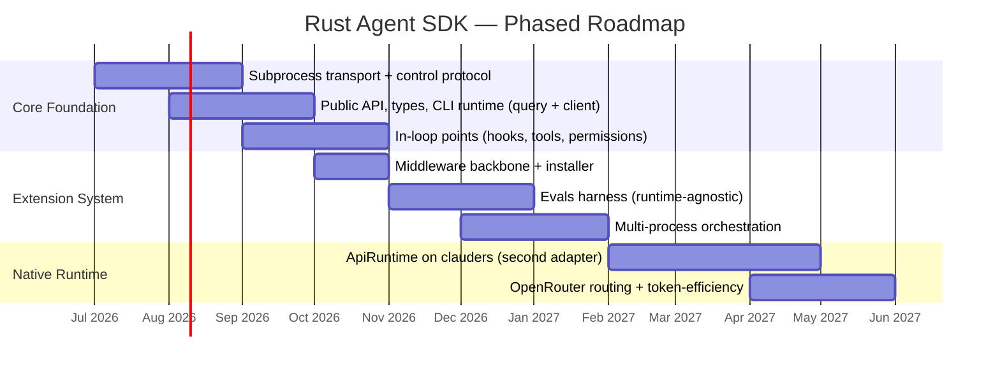

# clauders Agent SDK — Phased Roadmap

Source of truth for sequencing the Agent SDK work. Derived from the RFC
(`.airsstack/cc/plugins/sdd/rfcs/rust-agent-sdk.md`, §9 *Roadmap and Phasing*) and the
Phase-1 spec (`.airsstack/cc/plugins/sdd/specs/2026-06-09-clauders-agent-core-foundation.md`).

The work is sequenced so a usable, compatible artifact ships early and the expensive native
runtime arrives only after the public surface is proven and instrumented. All of it lives in the
existing `clauders` crate (sibling `agent/` module tree, behind the `agent` Cargo feature) — **no
new crate**.

---

## Phase 1 — Core Foundation

> Subprocess transport + control protocol, public API/types, the default CLI runtime, and the
> in-loop extension points. Alone, a usable Agent SDK on subscription auth, validated against real
> binary behavior.

| Workstream | Status |
|---|---|
| Subprocess transport + bidirectional control protocol (initialize handshake + correlated control req/resp) | ✅ done |
| Public API, core types, CLI runtime (`query()` one-shot + stateful `Client`) | ✅ done |
| In-loop extension points — **hooks** + **permission policy** | ✅ done (PR #10) |
| In-loop **in-process MCP tools** (`tool()` / `createSdkMcpServer`) | ⛔ deferred — spec cut to a later phase |

**Status: effectively complete.** The RFC gantt grouped "hooks, tools, permissions" in one
Phase-1 row, but the implemented spec deliberately scoped *in-process MCP tools* out (external MCP
servers stay as opaque pass-through to the binary). Hooks + permissions shipped; in-process tools
still owed.

Delivered across 3 plans:

- `2026-06-09-clauders-agent-process-module` — leak-safe subprocess management (`agent/process/`),
  no zombies / no orphans, tested against a controllable test-child (no `claude` dependency).
- `2026-06-10-clauders-agent-protocol-types` — NDJSON control protocol, codec/frames, core data
  types (`Message`/`ContentBlock`, `Options`, `AgentError`, `Capabilities`), the `Runtime` trait
  with `CliRuntime` + `MockRuntime`.
- `2026-06-17-clauders-agent-hooks-permissions` — in-loop hooks + permission policy, dispatcher
  routing inbound `can_use_tool` / `hook_callback` control requests (PR #10).

**Phase-1 carryovers**

- In-process MCP custom tools (`tool()` / `createSdkMcpServer`) — first item to schedule next.
- Real-binary e2e (`CLAUDERS_AGENT_E2E=1`) leaves 2 facts CI-unverified: binary accepting
  `--permission-prompt-tool stdio`, and the initialize `hooks` shape. Inherent to opt-in e2e.
- Windows full-descendant kill via Job Object (`KILL_ON_JOB_CLOSE`) — documented Phase-1 gap,
  tracked follow-up.

---

## Phase 2 — Extension System

> The extension backbone plus the first differentiating extensions.

| Workstream | Status |
|---|---|
| Middleware backbone + thin installer | ⬜ not started |
| Evals harness (runtime-agnostic) | ⬜ not started |
| Multi-process orchestration | ⬜ not started |

Typed extension *shapes* (runtime adapters, middleware, in-loop bundles, orchestrators, tool packs)
composed by a thin installer, with first-party defaults. Tower-style middleware model.
Multi-process orchestration is bounded by account concurrency / rate limits — the pool must enforce
bounded concurrency + backpressure.

---

## Phase 3 — Native Runtime

> The native `ApiRuntime` as the second `Runtime` adapter, then routing + token-efficiency on top.

| Workstream | Status |
|---|---|
| `ApiRuntime` on `clauders` (second `Runtime` adapter) | ⬜ not started |
| OpenRouter routing + token-efficiency | ⬜ not started |

**This is where the README's north star lands** — mixed routing (cheaper/alternative models via
OpenRouter: DeepSeek, Kimi K2, Qwen) and token-efficiency (per-subtask routing, context pruning).

Architectural constraint: the native `ApiRuntime` sits at the **whole-agent boundary** (the
`Runtime` trait), *not* at the wire-level transport seam — the Messages API does not speak the CLI
control protocol, so it reimplements the loop itself and emits the same `Message` types the core
defines. It is a large, separate build — not a config flag — kept strictly behind the `Runtime`
trait so it never leaks into the core surface.

---

## Roadmap (RFC §9 gantt, verbatim targets)

