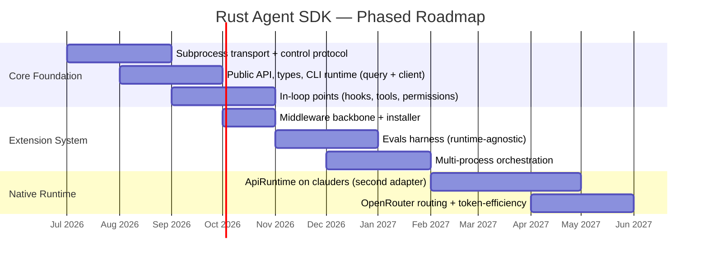

# clauders Agent SDK — Phased Roadmap

Source of truth for sequencing the Agent SDK work. Derived from the RFC
(`.airsstack/cc/plugins/sdd/rfcs/rust-agent-sdk.md`, §9 *Roadmap and Phasing*) and the
Phase-1 spec (`.airsstack/cc/plugins/sdd/specs/2026-06-09-clauders-agent-core-foundation.md`).

The work is sequenced so a usable, compatible artifact ships early and the expensive native
runtime arrives only after the public surface is proven and instrumented. All of it lives in the
existing `clauders` crate (sibling `agent/` module tree, compiled unconditionally — the crate carries
no Cargo features) — **no new crate**.

---

## Phase 1 — Core Foundation

> Subprocess transport + control protocol, public API/types, the default CLI runtime, and the
> in-loop extension points. Alone, a usable Agent SDK on subscription auth, validated against real
> binary behavior.

| Workstream | Status |
|---|---|
| Subprocess transport + bidirectional control protocol (initialize handshake + correlated control req/resp) | ✅ done |
| Public API, core types, CLI runtime (`query()` one-shot + stateful `Client`) | ✅ done |
| In-loop extension points — **hooks** + **permission policy** | ✅ done (PR #10) |
| In-loop **in-process MCP tools** (`tool()` / `createSdkMcpServer`) | ✅ done (a31f249) |

**Status: complete.** The RFC gantt grouped "hooks, tools, permissions" in one Phase-1 row; the
initial spec deliberately scoped *in-process MCP tools* out (external MCP servers stay as opaque
pass-through to the binary), and they landed in a follow-on plan. Hooks + permissions + in-process
tools all shipped.

Delivered across 3 plans:

- `2026-06-09-clauders-agent-process-module` — leak-safe subprocess management (`agent/process/`),
  no zombies / no orphans, tested against a controllable test-child (no `claude` dependency).
- `2026-06-10-clauders-agent-protocol-types` — NDJSON control protocol, codec/frames, core data
  types (`Message`/`ContentBlock`, `Options`, `AgentError`, `Capabilities`), the `Runtime` trait
  with `CliRuntime` + `MockRuntime`.
- `2026-06-17-clauders-agent-hooks-permissions` — in-loop hooks + permission policy, dispatcher
  routing inbound `can_use_tool` / `hook_callback` control requests (PR #10).

**Phase-1 carryovers**

- Real-binary e2e (`CLAUDERS_AGENT_E2E=1`) leaves 2 facts CI-unverified: binary accepting
  `--permission-prompt-tool stdio`, and the initialize `hooks` shape. Inherent to opt-in e2e.
- Windows full-descendant kill via Job Object (`KILL_ON_JOB_CLOSE`) — documented Phase-1 gap,
  tracked follow-up.

---

## Phase 2 — Extension System

> The extension backbone plus the first differentiating extensions.

| Workstream | Status |
|---|---|
| Middleware backbone + thin installer | ✅ done (9ea1429) — middleware-only; AgentBuilder facade deferred |
| Evals harness (runtime-agnostic) | ✅ done (0410a86) |
| Multi-process orchestration | ✅ done (cde5e33) — bounded-concurrency pool, ports-and-adapters |

Typed extension *shapes* (runtime adapters, middleware, in-loop bundles, orchestrators, tool packs)
composed by a thin installer, with first-party defaults. Tower-style middleware model.
Multi-process orchestration is bounded by account concurrency / rate limits — the pool must enforce
bounded concurrency + backpressure.

---

## Phase 3 — Native Runtime

> The native `ApiRuntime` as the second `Runtime` adapter, then routing + token-efficiency on top.

| Workstream | Status |
|---|---|
| ws1 — `ApiRuntime` on `clauders` (second `Runtime` adapter) | ✅ done (41d2a02) — native `POST /v1/messages` loop, in-process tools, control ops |
| ws2 Scope A — `OpenRouterRuntime` (third native `Runtime` adapter over openrouter-rs) | ✅ done (038bafe) |
| ws2 Scope B — `RoutingRuntime` (model-classified dispatch across adapters) | ✅ done (49161b7) |
| ws2 Scope C — token-efficiency | ✅ done (6fa63f5) — prompt caching (`CachePolicy` on `ApiRuntime`, cache-aware usage summed across turns); cost-aware routing + context pruning + per-subtask downgrade remain later/blocked slices |

**This is where the README's north star lands** — mixed routing (cheaper/alternative models via
OpenRouter: DeepSeek, Kimi K2, Qwen) and token-efficiency (prompt caching, cost-aware routing,
context pruning, per-subtask downgrade).

The single RFC row *OpenRouter routing + token-efficiency* is realized as Phase 3 **ws2**, split into
scopes: **A** `OpenRouterRuntime` (native adapter, done), **B** `RoutingRuntime` (classified dispatch,
done), **C** token-efficiency. Scope C is itself decomposed — **prompt caching** in `ApiRuntime` is the
first slice (unblocked, biggest raw token lever); cost-aware routing + classification-prompt bounding
are later unblocked slices; context pruning + per-subtask downgrade are **blocked** on primitives that
don't yet exist (a multi-turn conversation/history object; a subtask primitive).

Architectural constraint: the native `ApiRuntime` sits at the **whole-agent boundary** (the
`Runtime` trait), *not* at the wire-level transport seam — the Messages API does not speak the CLI
control protocol, so it reimplements the loop itself and emits the same `Message` types the core
defines. It is a large, separate build — not a config flag — kept strictly behind the `Runtime`
trait so it never leaks into the core surface.

---

## Phase 4 — Official CLI-Surface Parity

> Close the *worth-building* gaps against the official Python/TS Agent SDKs identified in the feature-
> parity analysis — while deliberately skipping CLI-feature passthroughs that fight the token thesis.

| Workstream | Status |
|---|---|
| A — system-prompt preset + append | 📋 planned |
| B — structured output on the agent layer | 📋 planned |
| C — `dontAsk` mode + `updated_permissions` + deny-interrupt | 📋 planned |
| D — `auto` permission mode (model-classified, reuse `RoutingRuntime` classifier) | 📋 planned |
| E1 — subagents `AgentDefinition` + CLI passthrough | 📋 planned |
| E2 — subagents native nested loop on `ApiRuntime` (per-subtask downgrade) | 📋 planned |
| F1 — sessions `SessionControl` + CLI passthrough | 📋 planned |
| F2 — sessions native conversation-history object (context pruning) | 📋 planned |
| G — streaming input | 📋 planned |
| H — MCP elicitation (after G) | 📋 planned |

Full scope, sequencing, per-workstream design sketches, and acceptance criteria live in the epic doc:
[`agent-sdk/phase-4-cli-parity.md`](./agent-sdk/phase-4-cli-parity.md). Each workstream is brainstormed
into its own SDD spec, then a plan, then executed — same structure Phases 1–3 used.

The two **native** slices (E2 native subagents, F2 native history object) double as the unblockers for
the roadmap's blocked Scope C token-efficiency slices (per-subtask downgrade, context pruning) — the
parity work and the token north star converge there.

---

## Roadmap (RFC §9 gantt, verbatim targets)

```mermaid
gantt
    title Rust Agent SDK — Phased Roadmap
    dateFormat YYYY-MM
    axisFormat %b %Y
    section Core Foundation
    Subprocess transport + control protocol         :2026-07, 2M
    Public API, types, CLI runtime (query + client) :2026-08, 2M
    In-loop points (hooks, tools, permissions)      :2026-09, 2M
    section Extension System
    Middleware backbone + installer                 :2026-10, 1M
    Evals harness (runtime-agnostic)                :2026-11, 2M
    Multi-process orchestration                     :2026-12, 2M
    section Native Runtime
    ApiRuntime on clauders (second adapter)         :2027-02, 3M
    OpenRouter routing + token-efficiency           :2027-04, 2M
```
