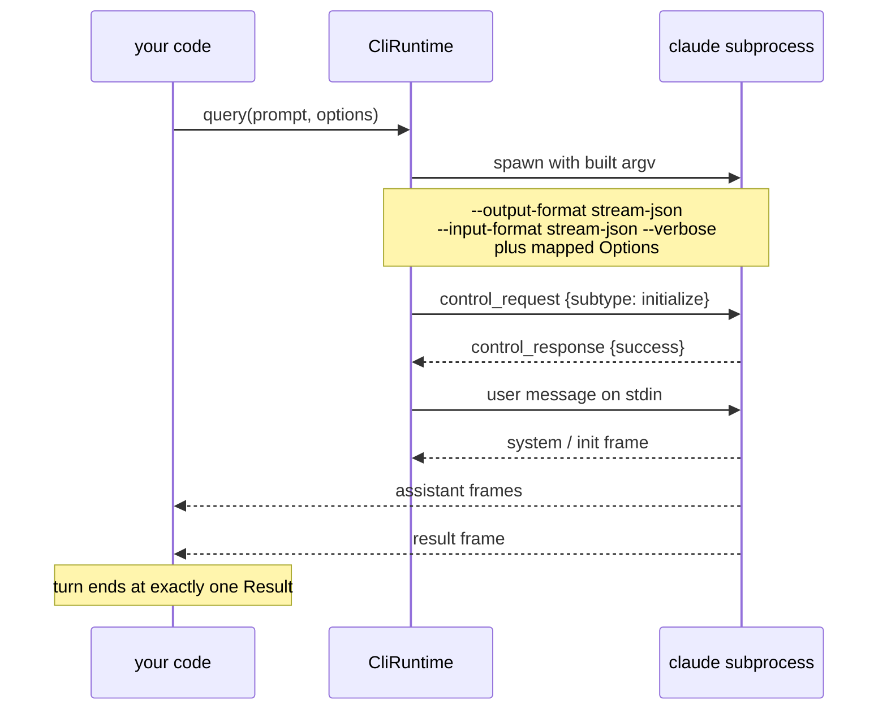
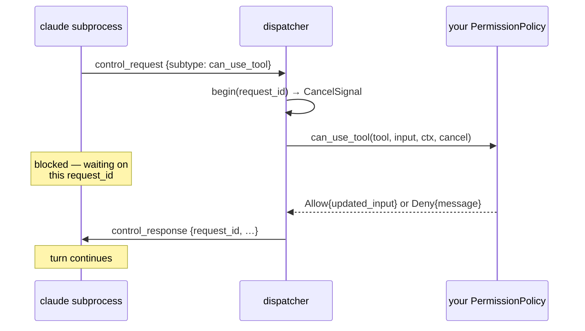

# Understanding the Agent SDK

Why this client is shaped the way it is. No instructions here — for those see the
[tutorial](tutorial.md) and the [how-to guides](how-to.md).

## It drives a binary, not an API

The most surprising thing about the Agent SDK, in any language, is that it does not talk to
Anthropic. It spawns the `claude` Code CLI as a subprocess and exchanges newline-delimited JSON with
it over stdin and stdout. The official Python and TypeScript SDKs do exactly the same thing;
clauders is not being unusual here, it is matching them.

Several consequences follow, and they trip people up in the same order every time.

**There is no API key.** `agent::Options` has no field for one. The binary already holds credentials
— subscription auth, an API key in its own config, whatever — and the SDK inherits them. If
`claude -p "hi"` works in your shell, the SDK works.

**The binary owns the agentic loop.** Tool selection, the tool-call cycle, context compaction,
permission prompting, subagent execution — all of it happens inside the subprocess. clauders
configures that loop and observes it. It does not run it. This is why so much of `Options` lowers to
a command-line flag: configuring the agent largely *is* constructing the right argv.

**The target moves faster than an HTTP API.** `POST /v1/messages` is a versioned contract with a
deprecation policy. The `claude` binary ships continuously and its control protocol carries no
version negotiation to speak of. Everything about forward compatibility in this module tree exists
because of that asymmetry.

## Four layers, each blind upward

`src/agent/` divides into four layers. The division is not decoration — each layer is genuinely
ignorant of the ones above it, and that ignorance is what makes the top two testable without a
`claude` binary anywhere on the machine.

| Layer | Knows about | Deliberately does not know about |
|---|---|---|
| `agent::process` | pipes, process groups, graceful shutdown, forced kill | that the child is `claude`; that the bytes are JSON |
| `agent::protocol` | frame shapes, the line codec | that a process exists |
| `agent::runtime` | the `claude` binary, its argv, its control protocol | who is consuming the frames |
| `agent::client` | sessions, turns, live control | how any of it is transported |

`agent::process` supervises *a* child process. Its tests drive a purpose-built helper binary,
`src/bin/clauders-agent-testchild.rs`, whose flags exist to provoke specific failure modes — a child
that ignores EOF, one that floods stderr, one that forks a grandchild into the same process group.
Proving there are no zombies and no orphans does not require Anthropic's binary, and it should not.

`agent::protocol` is a pure function in both directions. Lines in, frames out; frames in, lines out.
It never touches a file descriptor.

`agent::runtime` is where those two meet, and the `Runtime` trait at `src/agent/runtime/port.rs` is
the only trait boundary in the tree. `CliRuntime` implements it over a real subprocess. `MockRuntime`
implements it by replaying canned turns and recording the control calls it received.

`agent::client` is generic over `R: Runtime`, so it is concrete code with static dispatch — and it
can be exercised end to end against `MockRuntime`.

### Why a trait with one real implementation

A reasonable objection: there is exactly one production `Runtime`. Why not delete the trait and let
`Client` hold a `CliRuntime`?

Because the alternative is that no session logic can be tested without spawning a real agent. Every
test of "does a denied permission end the turn correctly" would need a `claude` binary, network
access, credentials, and a tolerance for non-determinism. The trait costs one indirection and buys a
test suite that runs anywhere.

It is kept dyn-safe, asserted by a compile-time check at `src/agent/runtime/port.rs:208`, though
nothing currently stores a `dyn Runtime`. That is cheap insurance, not an active requirement.

## A turn, end to end

What actually happens between `query(...)` and the first frame reaching your code.

Two details worth pulling out.

The `initialize` request is built at `src/agent/runtime/cli/handshake.rs:14`. It carries the system
prompt, any registered hook declarations keyed by the callback ids the registry minted, the
structured-output config, and the session title. The same body is reused by `reinitialize`, which
sends it over the live control channel rather than at spawn.

The capability manifest does **not** come back on that response. It arrives later, on the
`system`/`init` message frame. A caller who checks `capabilities()` before the first turn sees
nothing — that is documented behaviour, not a bug.

## `Options` is fixed at spawn; `Client` is not

Everything on `Options` is decided before the process starts, because most of it becomes argv. You
cannot change `cwd` or `allowed_tools` on a running agent for the same reason you cannot change a
process's arguments after `exec`.

The mid-session equivalents therefore live somewhere else — on `Client`, as control requests sent
down the same pipe. `set_model`, `set_permission_mode`, `toggle_mcp_server`, `set_max_thinking_tokens`
and the rest each issue a correlated request and await its response.

The split is worth internalising because it explains an otherwise odd asymmetry: `Options::model`
and `Client::set_model` do the same conceptual thing through completely different mechanisms.

Some `Client` methods cost nothing at all — `supported_models`, `supported_commands`,
`supported_agents`, `account_info` and `initialize_result` read the retained handshake response. Only
`reinitialize` re-sends it.

## Exhaustive, with an escape hatch

`agent::Message` is an exhaustive enum: match on it and the compiler will not let you forget a frame
kind. It also has `Message::Other(Value)`, which carries any frame this release does not model.

Those two properties sound contradictory and are not. Exhaustiveness is about *your* code — you
cannot silently ignore `Result` frames. `Message::Other` is about *the binary's* code — it can ship a
new frame kind tomorrow and your turn still completes, with the raw JSON available for inspection.

Without the catch-all, the failure mode is severe and non-obvious: a `claude` update adds one field
or one frame type, and every clauders program starts failing turns with a deserialization error. With
it, the same update is a log line.

Preserve this property in any new frame enum. It is the single most valuable thing in the module tree
given how fast the target moves.

## Your code runs inside the loop

Four traits let Rust participate rather than observe. All are registered on `Options` and consulted
by the runtime as the turn proceeds:

| Trait | Consulted when |
|---|---|
| `PermissionPolicy` | a gated tool is about to run |
| `Hook` | a lifecycle event fires |
| `Tool`, via `SdkMcpServer` | the model calls an in-process tool |
| `ElicitationPolicy` | an MCP server asks the user for input mid-call |

These are not callbacks the binary invokes. The binary sends an inbound *control request* down the
pipe, the dispatcher routes it to your handler, and the handler's return value becomes a correlated
control response.

The important edge is the note on the right. `Dispatcher::handle`
(`src/agent/runtime/cli/dispatch.rs:113`) awaits the handler's outcome and only then calls
`write_response` (`src/agent/runtime/cli/dispatch.rs:191`). A `PermissionPolicy` that never returns
means the response is never written, and the binary — which blocks on the correlated response —
stalls with it. This mirrors the official SDKs, which also await the handler with no timeout.

### Cancellation is cooperative

Every handler receives a `CancelSignal`. If the binary withdraws the request, the signal fires — but
nothing kills the handler task.

A handler that ignores the signal runs to completion and its answer is still written back. A handler
that cares should check `is_cancelled()` or await `cancelled()` and return early. This matches the
official SDKs, where an aborted request signals an `AbortSignal` rather than terminating anything.

The reasoning is ordinary Rust: async tasks cannot be safely killed mid-execution, and a handler
holding a lock or a half-written file should get to finish or unwind rather than vanish.

## Where this leaves parity

Because the binary owns the loop, most parity work is data plumbing — lowering an option to the right
flag, modelling a frame's fields, forwarding a control request. That makes it tractable and dull,
which is the correct shape for a compatibility client.

The places clauders deliberately differs are collected in [divergences.md](../divergences.md). What
matches and what does not is in [feature-parity.md](feature-parity.md).
