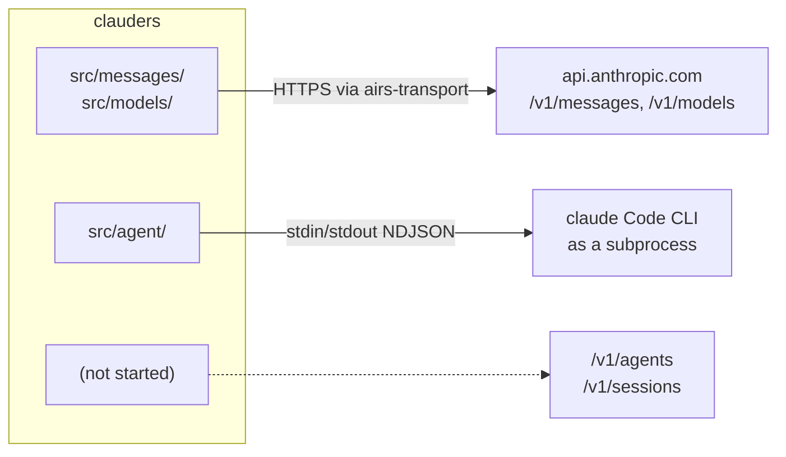
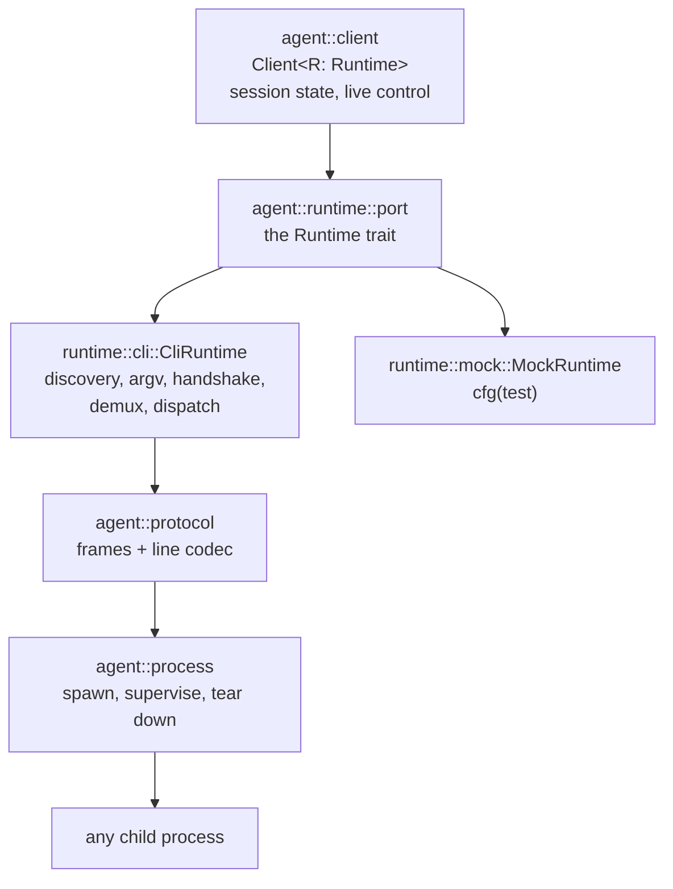

# Architecture

Orientation for someone who has not read this crate before, and the structural rules worth knowing
before your first edit.

`clauders` bundles clients for what Anthropic ships as separate products. That is the first thing to
internalise: the two implemented clients are not layers of one system, they are neighbours. One
speaks HTTP to `api.anthropic.com`. The other spawns a binary and speaks a line-delimited JSON
protocol down a pipe. Neither calls into the other.

## Three pillars

| Pillar | Official counterpart | clauders module | State |
|---|---|---|---|
| Messages API | the base SDK — `@anthropic-ai/sdk`, `anthropic` — a stateless `POST /v1/messages` client | `src/messages/`, `src/models/` | implemented |
| Agent SDK | `@anthropic-ai/claude-agent-sdk`, `claude-agent-sdk` — drives the `claude` Code CLI as a subprocess | `src/agent/` | implemented |
| Managed Agents | the beta server-hosted agents at `/v1/agents`, `/v1/sessions`, `/v1/environments` | — | not started |

The third row is an absence claim, so here is the search that establishes it.
`grep -rniE "managed_?agent|/v1/agents|/v1/environments" src/` returns nothing and exits 1. The same
method finds what is present: `grep -rn "/v1/messages" src/` hits `src/messages/resource.rs:1`,
`src/messages/request.rs:183`, `src/messages/response.rs:18`, and
`src/messages/token_counting.rs:2`. The search works; there is simply no Managed Agents code.



### What the pillars share

Almost nothing, and the exceptions are worth naming because they are the only places a change in one
can break the other.

- **`src/types/`** — the validating newtypes. `ModelId` is used throughout `src/agent/`
  (`src/agent/client.rs:26`, `src/agent/runtime/port.rs:20`, `src/agent/subagents/definition.rs:13`).
  `EffortLevel` is defined once at `src/types/effort.rs:30` and re-exported into the agent namespace
  by `src/agent/types/mod.rs:21`, so `agent::Options::effort` and the Messages API's
  `output_config.effort` are literally the same type.
- **`OutputConfig`** — the structured-output config. `src/agent/options.rs:21` imports it from
  `crate::messages::structured_outputs`, and `src/agent/runtime/cli/argv.rs:10` imports `OutputFormat`
  to unwrap the schema for the `--json-schema` flag. This is the *only* dependency from the agent
  tree into the messages tree.

There is no dependency in the other direction. `src/messages/` never mentions `agent`.

## The Agent SDK's four layers

The structural rule that matters most when editing `src/agent/`: each layer is blind to the one above
it, and the blindness is what makes the whole thing testable.



Read it bottom-up.

`agent::process` manages a child process and nothing else. It knows about pipes, process groups,
graceful shutdown windows and forced kills. It does not know the child is `claude`, and it has never
heard of JSON. That is why its tests drive a purpose-built helper binary
(`src/bin/clauders-agent-testchild.rs`) rather than the real thing — provoking a zombie or an orphan
does not require Anthropic's binary.

`agent::protocol` turns lines into frames and frames into lines. It never touches a process. Give it
a string, get a frame.

`agent::runtime` is where the two halves meet, and the `Runtime` trait at `src/agent/runtime/port.rs`
is the only trait boundary in the tree. `CliRuntime` implements it against a real subprocess;
`MockRuntime` implements it by replaying canned turns and recording control calls.

`agent::client` is generic over `R: Runtime` and therefore concrete — no dynamic dispatch, no
subprocess required. Session and client logic can be tested with no `claude` binary present anywhere
on the machine.

The trait carries 23 methods (`src/agent/runtime/port.rs:30-200`) — `run`, plus 22 control and
introspection operations — and is asserted dyn-safe by a compile-time check at
`src/agent/runtime/port.rs:208`.

## The Messages API's shape

`Client<T = ReqwestTransport>` (`src/client.rs:42`) is generic over the HTTP transport rather than
holding a boxed trait object. Cloning is a refcount bump: the state lives behind
`Arc<ClientInner<T>>` (`src/client.rs:46`), so passing a client around costs nothing.

Resource handles borrow the client and are made inline at the call site rather than stored:

```rust
client.messages()             // MessagesResource   — src/client.rs:122
client.models()               // ModelsResource     — src/client.rs:131
client.messages().batches()   // BatchesResource    — src/messages/resource.rs:351
```

Construction goes through a type-state builder (`src/builder.rs`). `ClientBuilder<Missing, T>` has no
`build` method at all — it appears only once `api_key` has moved the builder to
`ClientBuilder<Present, T>` (`src/builder.rs:183`). A client without credentials is not a runtime
error to handle; it is a program that does not compile.

The same pattern governs requests: `MessageRequest::builder()` will not produce a request until both
`model` and `max_tokens` are set.

## Conventions worth knowing before you edit

**`#![forbid(unsafe_code)]`** at `src/lib.rs:41`. Not a lint — the crate will not compile with unsafe
in it.

**`mod.rs` and `lib.rs` are tables of contents.** Module docs, `mod` declarations, `pub use`. No
implementation. Every implementation lives in a sibling file named after the thing it defines.

**Values are parsed at construction, not validated at use.** `src/types/` holds newtypes — `ApiKey`,
`BaseUrl`, `ModelId`, `MaxTokens`, `Temperature`, `BetaHeader` — each with its own `Invalid*` error.
Once you hold the type, the invariant is proven. A new domain value belongs here, not as a bare
`String` or `u32` parameter.

**The workspace declares no Cargo features.** Every module compiles unconditionally, so
`--all-features` is identical to the default build. The flag stays in the gate commands for the day
that changes, not because it does anything today. The `mockall` transport double lives in
`src/test_support.rs` behind `#[cfg(test)]`, not behind a feature.

**Unit tests are colocated.** Each logic-bearing `src/*.rs` carries its own `#[cfg(test)] mod tests`.
Integration tests under `tests/` complement those; they do not replace them.

**Forward compatibility is a contract, not a nicety.** `agent::Message` is exhaustive but carries
`Message::Other`, so a newer `claude` release emitting an unmodelled frame cannot fail a turn. On the
Messages side every server-decoded enum carries a payload-retaining `Unknown` arm for the same
reason. Preserve this property in any new frame or response enum — see
[divergences.md](divergences.md) for why the payload is retained rather than discarded.

## Where to go next

- The design discussion for each client: [Messages](messages-sdk/explanation.md),
  [Agent](agent-sdk/explanation.md).
- What differs from the official SDKs, and why: [divergences.md](divergences.md).
- What is and is not at parity: [Messages](messages-sdk/feature-parity.md),
  [Agent](agent-sdk/feature-parity.md).
