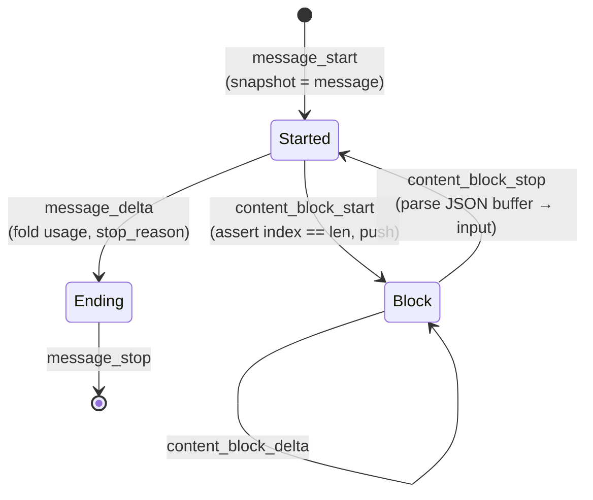

# Understanding the Messages API client

Why this client is shaped the way it is. No instructions here — for those see the
[tutorial](tutorial.md) and the [how-to guides](how-to.md).

## Generic over the transport, cheap to clone

`Client<T = ReqwestTransport>` (`src/client.rs:42`) takes its HTTP transport as a type parameter
rather than holding a `Box<dyn HttpTransport>`.

The immediate payoff is testing. `tests/` drives a real `wiremock` server, but unit tests inside
`src/` use a `mockall` double (`src/test_support.rs`) that implements the same trait, and neither
approach needs a network. Because `T` is monomorphised, none of that costs a virtual call at runtime.

The second payoff is that a caller can bring their own transport — a `reqwest` client with custom
timeouts, connection pooling, or proxy settings — through `Client::builder_with_transport`. That
entry point is infallible, since nothing is being constructed. `Client::builder()` is fallible
precisely because it does construct a `ReqwestTransport`, and TLS backend initialisation can fail.

Cloning is a refcount bump. All state lives behind `Arc<ClientInner<T>>` (`src/client.rs:46`), so
handing a client to twenty tasks copies a pointer twenty times. `Client::ref_count` exists to make
that observable in tests.

## Builders that will not compile when incomplete

Two type-state builders sit at the front of this client, and they exist to delete a category of
error rather than to be elegant.

`ClientBuilder<Missing, T>` has no `build` method. It is not that `build` returns
`Err(MissingApiKey)` — the method does not exist on that type. Calling `.api_key(k)` consumes the
builder and returns `ClientBuilder<Present, T>`, and only that type has `build`
(`src/builder.rs:183`).

The same rule governs `MessageRequest::builder()`: `model` and `max_tokens` are required, and the
request cannot be built until both are set.

What this removes is a whole class of runtime failure. There is no `BuilderError::MissingApiKey` to
handle, no test to write for it, no production incident where a config path forgot to set the key.
The compiler rejects the program.

The states are sealed (`src/builder.rs:47`), so a downstream crate cannot invent a third one and
route around the check.

## Two content-block unions, not one

This is the design decision most worth understanding, because it differs from every official SDK.

Anthropic's API uses different block sets in each direction. Responses carry 12 kinds. Requests
accept 17 — the same 12, plus `image`, `document`, `search_result`, `tool_result`, and
`mid_conversation_system`. The official SDKs model both with loose unions and let you pass either
one anywhere.

That is fine in TypeScript, where nothing validates, and survivable in Python. In Rust it produces a
specific failure: you echo an assistant turn back into the next request — the ordinary multi-turn
pattern — and one of its blocks was a `server_tool_use` or a `container_upload`, which cannot be
sent. With one shared enum, that compiles and then fails at serialization time with a message about
an unserializable block, at runtime, in production.

So there are two types. `ContentBlock` (`src/messages/content/block.rs:30`) is what comes back.
`ContentBlockParam` (`src/messages/content/param.rs:27`) is what you send. They share their leaf
structs — `TextBlock` and `ThinkingBlock` are defined once and reused — but they are distinct enums.

The multi-turn pattern still has to work, so the conversion exists and is fallible:

```rust
impl TryFrom<ContentBlock> for ContentBlockParam {
    type Error = UnsendableBlock;
}
```

`UnsendableBlock` names the offending wire `type` (`src/messages/content/param.rs:89-110`). The
batch form, `try_from_response` (`src/messages/content/param.rs:143`), is all-or-nothing: it fails on
the first unsendable block rather than quietly dropping it, because silently sending a shorter
history than you meant to is worse than an error.

`ContentBlockParam` is closed — no `Unknown` arm. It does not need one: you only ever construct block
kinds this crate names.

## Unknown values are kept, not discarded

Anthropic's versioning policy says new content-block types and new SSE event types may appear within
`anthropic-version: 2023-06-01`. The streaming guide says outright that clients should handle unknown
event types gracefully. A client that fails the decode is not being strict; it is being wrong.

So every enum decoded from a server response carries an unknown arm. There are ten of them —
`ContentBlock`, `ContentDelta`, `StreamEvent`, `StopReason`, `ErrorType`, `BatchStatus`,
`MessageKind`, `BatchKind`, `DeletedBatchKind`, `ModelInfoKind`.

The part worth defending is that the arm carries the payload rather than merely recording that
something was unrecognised. A block whose type this release does not model still arrives as
`ContentBlock::Unknown(Value)` with its full JSON intact, so a caller can inspect it, log it, or
handle it ahead of a crate update. Every official SDK retains this data — Python through
`__pydantic_extra__`, TypeScript by not validating, Go through `RawJSON()`. Discarding it would make
this the only client in the family that loses information the server sent.

`ContentBlock::Unknown` is the one asymmetric case. It alone also derives `Serialize`, so it carries
`#[serde(untagged, skip_serializing)]` (`src/messages/content/block.rs:69`): an unknown block can be
read but not echoed back. Round-tripping a block nobody understands is worse than refusing to.

One consequence follows from the mechanism, not the intent. A payload-carrying untagged fallback
absorbs a *known* discriminant whose body fails to satisfy its variant — so a `server_tool_use` with
a `name` outside the closed `ServerToolName` set lands in `Unknown` rather than erroring. That is
pinned by test, and it is the right trade: degrade the one block, keep the response.

## Validation happens at construction

`src/types/` holds newtypes — `ApiKey`, `BaseUrl`, `ModelId`, `MaxTokens`, `Temperature`, `TopP`,
`TopK`, `BetaHeader`, `AnthropicVersion` — each with its own `Invalid*` error.

The rule is parse, don't validate. `BaseUrl::parse` checks the scheme once, at the boundary; the
builder that stores it never has to re-check, and `build()` never has to return a URL error. By the
time a value reaches the request path, its invariant is a property of its type rather than something
a downstream function hopes someone checked.

This is also why `MaxTokens::new` is infallible. Every `u32` is a legal `max_tokens` — including `0`,
which the API documents as the way to pre-warm a prompt cache without generating. An earlier version
of this crate rejected `0` and made that call unrepresentable.

## The streaming accumulator

`create` returns a whole `Message`. `stream` returns events, and events are not a message — they are
a construction protocol for one. Something has to hold the partial state, and that is
`MessageAccumulator` (`src/messages/accumulator.rs`).

The rules only make sense against the event order:



Each delta kind has its own rule, and they are not the same rule:

| Delta | What the accumulator does | Where |
|---|---|---|
| `text_delta` | concatenate onto `TextBlock.text` | `accumulator.rs:243` |
| `thinking_delta` | concatenate onto `ThinkingBlock.thinking` | `accumulator.rs:248` |
| `signature_delta` | **replace** the signature, not concatenate | `accumulator.rs:256` |
| `citations_delta` | append onto `TextBlock.citations` | `accumulator.rs:262` |
| `input_json_delta` | buffer the raw fragment beside the snapshot | `accumulator.rs:228` |

Tool arguments are the interesting case. They stream as raw JSON fragments that are only valid once
concatenated — `{"cit`, `y": "Par`, `is"}` — so parsing each one as it arrives is not possible. They
accumulate in a side buffer and are parsed in a single pass at `content_block_stop`
(`src/messages/accumulator.rs:290-311`), then written onto the addressed `ToolUse` or `ServerToolUse`
block. An empty buffer is left alone, so the `input` value the block opened with survives.

The signature rule matters more than it looks. An extended-thinking block's signature must round-trip
verbatim or the API rejects the next turn — concatenating fragments there produces a value that looks
plausible and is rejected on the following request.

Several of the accumulator's edge behaviours differ deliberately from the official SDKs, which differ
from each other. Those are recorded in [divergences.md](../divergences.md) rather than here.

## What is not modelled, and why that is visible

The response block taxonomy is complete: 12 of 12. The request taxonomy is not — six of 17, missing
`search_result`, `mid_conversation_system`, and the response-only kinds that only appear in requests
when echoing history. Tool definitions cover the custom-tool case only; the 18 server-side and
Anthropic-defined tool types are absent.

These are gaps, not divergences, and they are listed as such in
[feature-parity.md](feature-parity.md). The distinction matters: a gap is work not done, a divergence
is a decision made.
